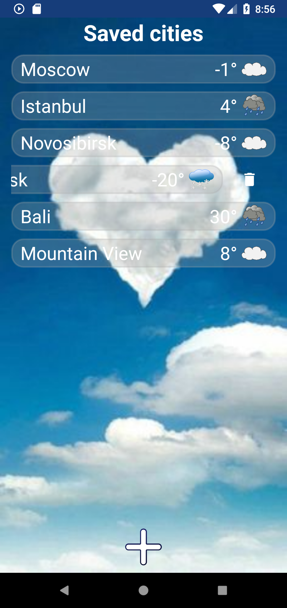
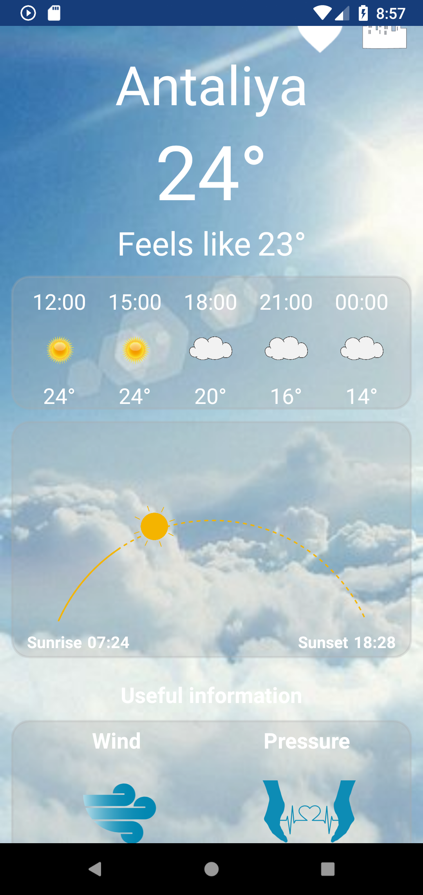

# WAY
*(Weather around you)*
 
## Descriotion: 
Simple App collecting information about weather from all around the world. You can easy define your location and start observing the weather.
Moreover, you can find any cities you want and add them into your persinal library. This app using beautiful animation, allowing you to dive into current weather.
Look after sunset and observe the four-days forecast. 
	

    

## Tech Stack:

<li> MVP </li>
<li> KOIN </li>
<li> RXJava3 </li>
<li> Room </li>
<li> Retrofit </li>
<li> JSON data parsing </li>
<li> SwipeLayout </li>
<li> Glide </li>
<li> Clean architecture </li>
<li> Moxy </li>
<li> RecyclerView/ViewType/DiffUtil </li>
<li> Single Activity </li>
<li> WeatherView </li>
<li> Lottie animation </li>
<li> Google Geolocation services </li>
